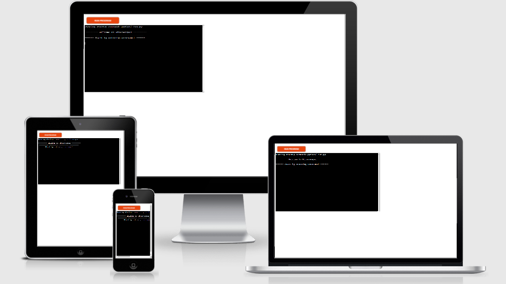
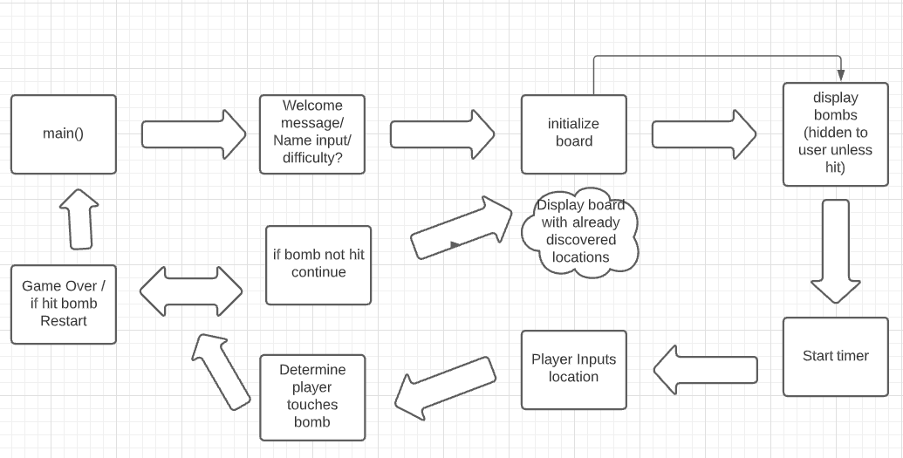
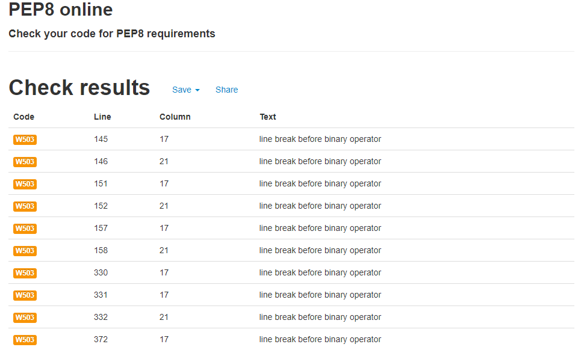
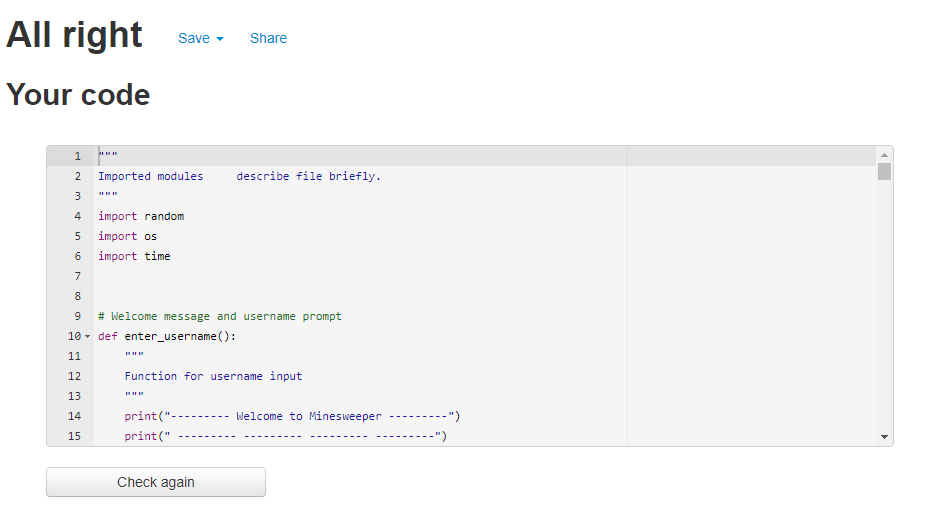

# Minesweeper 

## Python 3 Project by Mateusz Leks
---
<br>



# Project introduction

This is a back end application with a purpose of creating a game of minesweeper in command-line using Python3.

Minesweeper is run in code institutes custom terminal running on the [Heroku](https://www.heroku.com/home) platform.


[Click here to access and play!](https://minesweeper-matt.herokuapp.com/)
-
<br>
(I recommend users to open links in this README with CTRL + left mouse button (Windows) Control + click, for Mac)

To find out more about [Minesweeper](https://en.wikipedia.org/wiki/Minesweeper_(video_game)) - Click here!!

# Content Navigation
- [UX](#ux)
  * [User stories](#user-stories)
  * [Features](#features)
- [Application design](#application-design)
- [Planning](#planning)
- [Technologies Used](#technologies-used)
- [Testing](#testing)
- [Validation](#validation)
- [Site Deployment](#site-deployment)
- [Credits](#credits)
- [Media](#media)
- [Acknowledgements](#acknowledgements)
# UX

## User stories
* New Users
    1. As a new user I want the game rules to be digestable.
    2. As a new user I want to receieve feedback in terminal for my input.
    3. As a new user I want to play a clearly laid out game.
    4. As a new user I want to be able to restart the game or quit if I wish.

* Returning Users
    1. As a returning user I want to see updated features and bug fixes.
    2. As a returning user I want to see more difficulty options to further test my skils.
    3. As a returning user I want to be able to time a playthrough.
    4. As a returning user I want to see a high scores / game score feature.

## Features
* Username selection
* Randomised Game grid
* Randomised Mine placement
* Flagging mines
* Game Restart
## Future Features
* Game time elapsed
* Improve scaleability of game board
  to support larger game boards.

# Application design

## Game instructions
1. Enter Username.
2. Select difficulty from 4 (Easy) 6 (Standard) 8 (Hard).
3. Enter Row and column input.. Example '3 5' to flag a cell.. Example '3 5 F'.
4. Repeat above actions until game completed or you hit a mine.
5. If you lose you are prompted to enter '1' for restart and '2' to terminate app.

## Game Logic
* 
# Planning
* My first overall ideas for planning was to display a welcome message to the user with the name of the application.
* Then the user inputs name and they get an input return.
* The next part in the logic would be to initialize the game board with rows and colums that are numbered to help user input their moves.
* After displaying the board I inject the bombs into the grid which are hidden to the user until they hit a cell with one in it.
* The user then is asked to input row and column which the code then checks and sees if there is a bomb or if its an empty cell also providing information on where the next bomb could be with numbers.
* The game continues until a bomb has been hit in a loop.
* If the user hits a bomb they are asked if they would like to restart which restarts the whole game from beginning, if the user chooses to terminate the game is closed.


# Technologies Used

## Coding Languages
---
* [HTML5](https://en.wikipedia.org/wiki/HTML5). - Site structure.

* [CSS3](https://en.wikipedia.org/wiki/CSS). - Site Design

* [JavaScript](https://en.wikipedia.org/wiki/JavaScript). - Used to build the template supplied by Code Institute.

* [Python3](https://en.wikipedia.org/wiki/Python_(programming_language)). - Main language used for game logic and code.

* [Markdown](https://en.wikipedia.org/wiki/Markdown). - Used for Writing this README document.

## Libraries
---
* [Python Time](https://docs.python.org/3/library/time.html). - Used for Time.sleep to delay code and help return input to user.

* [Python Random](https://docs.python.org/3/library/random.html). - Used for randomising the game board with mine placement.

* [Python os](https://docs.python.org/3/library/os.html). - Used for clearing the terminal.

# Testing

## Purpose and functionality testing

* I tested my code where possible during development in Gitpod and fixed errors when they appeared in terminal where possible.
* I also used Python tutor to write out functions to make sure they worked first before implementing into gitpod this sometimes provided unexpected results which had to be further tweaked in the Gitpod environment.

## User Testing

* I have asked some friends and fellow students from slack to test my minesweeper game by play testing the application.

* An issue where the game was restarting with a game board still filled with values from previous playthrough and not showing a cleared game board was resolved by using global variables and then defining the values in main(): which fixed the issue and enabled the game to restart as intended.

* I was also recommended to change some print statement wording and layouts to improve readability and make the terminal look cleaner and appear on one line where possible.

## Bugs and errors and validation

* I encountered an error with Pep8 while trying to fix a line too long error with my code.
* I have receieved an error code W503 in Pep8 with "line break before binary operator" due to wrapping my code with brackets and making it multi line on lines shown in the image below.



### After fixing Pep 8 error



# Site Deployment 
* Deploying project to Heroku - [Live Link](https://minesweeper-matt.herokuapp.com/)

    * This project was created with Code institutes Portfolio 3 template.

## Cloning using Github
* Log in to Github.
* Access my repository using above link.
* In repository page select code next to Gitpod.
* Button, make sure HTTPS is selected.
* Click on the copy button on the right (Two overlapping squares)
* Open a new workspace in Gitpod.
* Once the workspace loads in the terminal type.
```
git clone https://github.com/Matex600/minesweeper-matt
```
* This command will now clone this repo for use in your Gitpod.
* In Gitpod workspaces click the three dots and pin workspace to avoid losing it!
* Do not use the Gitpod button in Github again when you have your workspace already set up to avoid losing data.

## Deployment via Heroku
* Go to [Heroku](https://www.heroku.com/home).
* Log in to your account.
* Once in your Dashboard, Create new app
* Select an app name and a region and press create app
* You have now created a Heroku app
* Navigate to the settings tab
* Click on the Reveal Config Vars button
* If you have a creds.json file in gitpod add a 
Key with name CREDS
* In the Value section copy and paste contents from creds.json file.
* For the second key this one is required for the app to work once deployed
* In Key enter PORT for Value enter 8000.
* Select Add
* Scroll down to Buildpacks section
* Once in this section click on Add Buildpack, Select Python
* Repeat above action but select node.js instead.
* Once this is completed Ensure that Python is above node.js within the list.
* Navigate to the Deploy tab
* In the deployment section select Github
* Enter the Repo name and once you have found the corresponding repo confirm the selection.
* Scroll down to Enable Automatic Deploys and enable this feature to ensure automatic updates everytime you use git push in gitpod.
* Lastly to deploy click on deploy branch in manual deploy this could take up to a few minutes.
* Once deployed successfully a message will appear and a View button taking you to the deployed app if nothing is showing allow some time for Heroku to work.

# Credits

## Media
[amiresponsive](http://ami.responsivedesign.is/) - For use of their site to add image to top of my README.

## Acknowledgements

My mentor Maranatha Ilesanmi has helped motivate me throughout this project and offer useful advice on how to further improve my knowledge.

[Code Institute](https://codeinstitute.net/) - For providing me with learning material that has prepared me for this Python in terminal project.

[FreeCodeCamp](https://www.youtube.com/watch?v=rfscVS0vtbw) - For helping me understand Python further.

[Lucid Chart](https://www.lucidchart.com/pages/examples/flowchart-maker) - For helping my map out my code logic